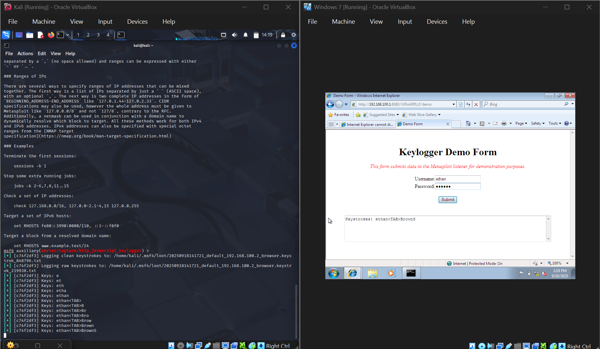

# Lab 1 — Keylogger

## Objective
Understand how keyloggers work as a data-theft threat, demonstrate one, and document how organizations detect and defend against them.

## Environment / Setup
- Course: CIS 425 (group lab, Team 4)
- Artifacts: `Keylogger Report.docx`, `Keylogger.png`, `Lab1 - Keylogger.pptx`

## Background
A keylogger is software or hardware that records every keystroke a user makes. Attackers use them to silently capture usernames, passwords, and other sensitive data. They can also have legitimate uses (employee monitoring, troubleshooting), but in the wrong hands they're a serious threat because they run in the background and transmit stolen data without obvious signs of infection.

## Why it's dangerous
- Silently steals credentials → identity theft, financial loss, full data breach.
- Especially dangerous for online banking, private email, and work systems.
- Often undetected because it doesn't visibly slow the machine.

## Defenses / Mitigations
- Keep systems patched; run reputable antivirus/anti-malware (can detect & block keyloggers).
- **Multi-factor authentication (MFA)** — stolen passwords alone aren't enough.
- User habits: caution with downloads and email links.
- Virtual keyboards / password-manager autofill reduce keystroke exposure.

## What I Learned
Keyloggers are a subtle but serious credential-theft threat. The strongest single control is MFA, because it breaks the value of stolen passwords — a good example of defense-in-depth beating any one perfect control.

## Related
- Sec+ domain 2: malware types, indicators of compromise
- Concept: MFA / AAA

## Screenshot

