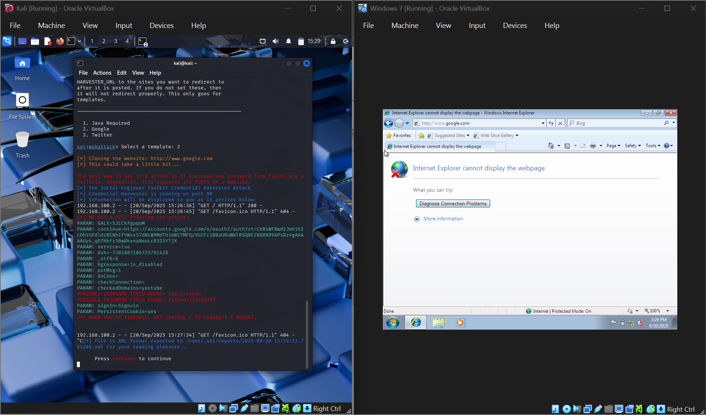

# Lab 2 — Metasploit, SET & Response

## Objective
Explore the Social-Engineer Toolkit (SET) and Metasploit, demonstrate a social-engineering attack chain, and document how to respond to SET-style threats.

## Environment / Setup
- Course: CIS 425 (group lab, Team 4)
- Artifacts: `CIS 425 Lab 2 SET Report.docx`, `Lab2 PPT.pptx`, `SET_Attack.png`

## Tools
- **Metasploit** — open-source exploitation framework: pre-built exploit modules, scanners, payload builders. Payloads like **Meterpreter** give an interactive remote session (explore files, escalate privileges, capture credentials) with minimal disk changes.
- **SET (Social-Engineer Toolkit)** — attacks *people* rather than software. Automates spear-phishing emails, cloned login pages, and malicious attachments. The chain: social lure → user action → code execution. Its power is psychological — urgency, authority, and routine.

## Response / Mitigations
- **Preventive:** MFA, strong email filtering + URL scanning, regular phishing exercises.
- **Detection & containment:** EDR, centralized logs, timely patching.
- **If compromised:** isolate affected systems, capture forensic records, rotate exposed credentials, hunt for persistence / lateral movement.
- **After:** root-cause review, update training and controls.

## What I Learned
The most powerful attacks chain a social lure into technical code execution — SET gets the foot in the door, Metasploit does the rest. Defense has to be layered across people (training, MFA) and technology (EDR, logging), because no single control stops the full chain.

## Related
- Sec+ domain 2: social engineering, penetration testing concepts
- See also: [[Phishing Email Lab]]

## Screenshot

