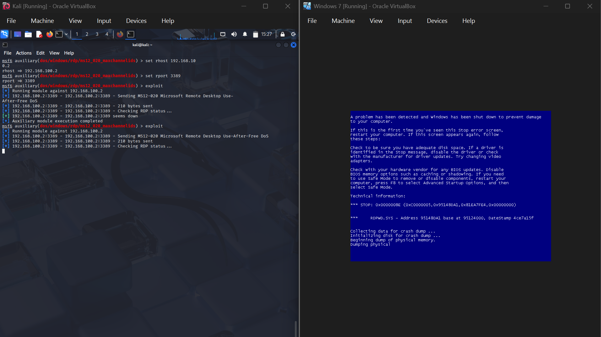

# Lab 4 — Understanding DDoS Attacks

## Objective
Explain the purpose and mechanism of Distributed Denial of Service (DDoS) attacks and document layered defenses.

## Environment / Setup
- Course: CIS 425 (group lab, Team 4)
- Artifacts: `CIS 425 Lab 4 Essay DDoS.docx`, `DoS.png`, `Lab4 PPT.pptx`

## What it is
A DDoS attack uses multiple compromised systems (often a **botnet**) to flood a target with traffic, overwhelming resources and disrupting normal operations.

## Attacker motivations
- **Disruption** — cripple online presence, damage reputation.
- **Diversion** — distract from data theft / infiltration happening elsewhere.
- **Extortion** — demand payment to stop.
- **Ideology / prowess** — protest or showing off.

## Attack types
- **Volumetric** — consume bandwidth.
- **Protocol** — exploit weaknesses in network layers.
- **Application-layer** — mimic legitimate users to exhaust server resources.

## Defenses / Mitigations
- IDS/IPS, **rate limiting**, web application firewalls (WAF).
- **CDNs and cloud-based DDoS mitigation** to absorb/reroute traffic.
- Scalable infrastructure + a defined incident response plan.
- Continuous monitoring and collaboration with ISPs.

## What I Learned
DDoS targets the **availability** leg of the CIA triad, and there's no single fix — defense is about absorbing/rerouting traffic (CDN, cloud scrubbing) plus filtering (WAF, rate limiting). The "diversion" motive was the most eye-opening: an outage can be cover for a quieter breach.

## Related
- Sec+ domain 2: denial of service, network attacks
- Concept: CIA triad — availability

## Screenshot

